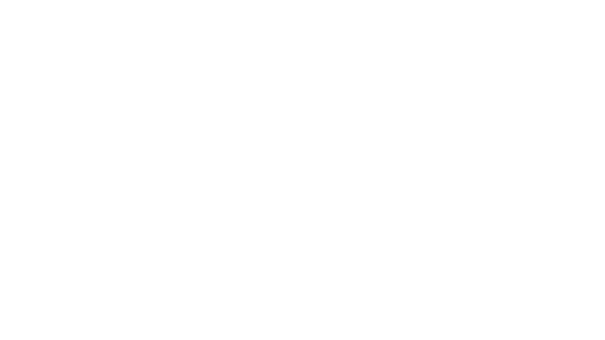
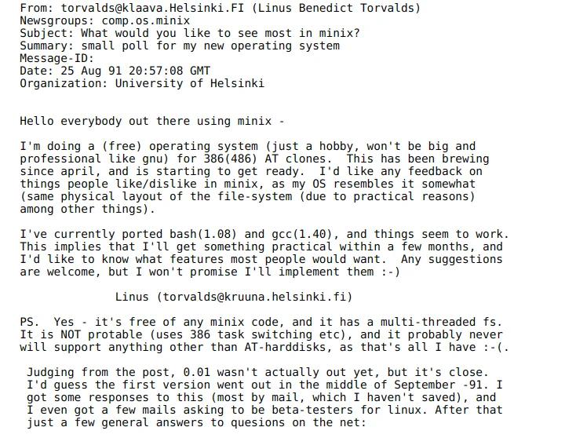

<!-- _class: lead -->

# Conociendo el potencial de la comunidad
8/11/2024

---

## Whoami

🔹 Apasionado del software libre
🔹 Estudiante de la Universidad de Castilla-La Mancha
🔹 Nix Advocate
🔹 Fediverse: [@amerinor01@mastodon.social](https://mastodon.social/@amerinor01)
🔹 Matrix: @amerino:matrix.org

---

# Historia del Open Source

<!--
## En el comienzo de los tiempos...

... solo existía el código privado. La mayoría del software era muy enfocado al mundo académico, y solo las universidades podían permitírselo. El acceso a las herramientas informáticas era muy limitado y cerrado, ya que las compañías controlaban su distribución.
-->

---

## En los años 70 y 80...

<!--
**Richard Stallman**, en el laboratorio de inteligencia artificial del MIT, comenzó a cuestionar este modelo. Tras enfrentarse a restricciones de acceso a software esencial, se dio cuenta de lo importante que sería permitir que los usuarios pudieran estudiar, modificar y compartir el código.
-->

## [Todo por una impresora](https://smaldone.com.ar/documentos/libros/faif/chapter-1.html)

<!--
En 1983, Stallman lanzó el **Proyecto GNU**, con la visión de crear un sistema operativo completamente libre. Para 1985, Stallman publicó la **Licencia Pública General de GNU (GPL)**, una de las primeras licencias que garantizaba la libertad de usar, modificar y distribuir software.
-->

---

## El crecimiento y la expansión

---

<!--
En los 90s, el **Kernel Linux** de **Linus Torvalds** revolucionó la industria. Combinado con el software del Proyecto GNU, permitió que naciera una alternativa completamente libre y abierta a los sistemas operativos privativos como Windows y MacOS.

-->

---

<!--
Hoy en día, el **software libre** es la base de muchos sistemas, desde servidores web hasta el software de desarrollo más popular. Grandes proyectos como **Firefox**, **Apache**, **VLC** y muchos otros han transformado el panorama tecnológico global.
-->

## ¿Qué es el Software Libre?

- **Definición**: Software que respeta la libertad de los usuarios.
- Permite:
  - **Usar** el software para cualquier propósito.
  - **Estudiar** cómo funciona y modificarlo.
  - **Distribuir copias** para ayudar a otros.
  - **Mejorar el software** y compartirlo.

---

## Software Libre vs. Software Privado

- **Software libre**:
  - Transparente, colaborativo y adaptable.
  - Menos costos de licencia.
  - Mayor seguridad por ser auditable.
- **Software privado**:
  - Restricciones de uso y modificaciones.
  - Dependencia del proveedor.
  - Menos control sobre tus datos.

---

# Casos de Software Libre vs. Privado

---

## GNU/Linux vs. MacOS/Windows

- **GNU/Linux**:
  - Flexible y personalizable.
  - Gran variedad de distribuciones.
- **MacOS/Windows**:
  - Sistemas populares, pero cerrados.
  - Menor control para el usuario.

---

## GIMP vs. Photoshop

- **GIMP**:
  - Alternativa libre para edición de imágenes.
  - Sin costos de licencia.
- **Photoshop**:
  - Software propietario con mayor popularidad.
  - Licencias de pago.

---

## FreeCAD/KiCad vs. AutoCAD/Altium

- **FreeCAD/KiCad**:
  - Diseño 3D y de PCB.
  - Acceso gratuito.
- **AutoCAD/Altium**:
  - Potentes, pero con licencias costosas.

---

# Herramientas de Desarrollo de Software Libre

---

## Editores de Código

- **Vim/Neovim**: Configurables y ligeros.
- **Emacs**: Plataforma extensible y flexible.
- **VSCode**: Popular y extensible (Code - OSS es la versión libre).

---

# Dónde Formarse en Software Libre

---

## Páginas Web

- [GNU.org](https://www.gnu.org): Filosofía del software libre.
- [Linux Foundation](https://www.linuxfoundation.org): Cursos sobre Linux.
- [Arch Wiki](https://wiki.archlinux.org/): BTW.
- [Github](https://github.com/).

---

## Blogs

- [Opensource.com](https://opensource.com): Proyectos y noticias.
- [Planet Debian](https://planet.debian.org): Blog de desarrolladores de Debian.
- [Linux Adictos](https://www.linuxadictos.com/): Noticias Open Source en Español.

---

## Podcasts y Canales de YouTube

- **Podcasts**:
  - _Linux Unplugged_: Noticias de Linux.
  - _AtareaoConLinux_: Podcast en español.
- **YouTube**:
  - _Michael Horn_: Tutoriales de software libre y análisis.
  - _The Linux Experiment_: Comparativas y análisis de distros.

---

# Cómo Introducirse como Desarrollador de Software Libre

---

## Proceso Personal

1. **Escoge** una tecnología que te interese o uses en tu carrera.
2. **Explora repositorios** en GitHub o GitLab.
3. **Busca issues** con etiquetas como "Good First Issue".

---

## Oportunidades

- **Summer of Nix** y **Google Summer of Code**:
  - Programas de prácticas remuneradas.
  - Trabajas directamente con mentores y desarrolladores expertos.

---

# Conociendo el potencial de la comunidad
8/11/2024

